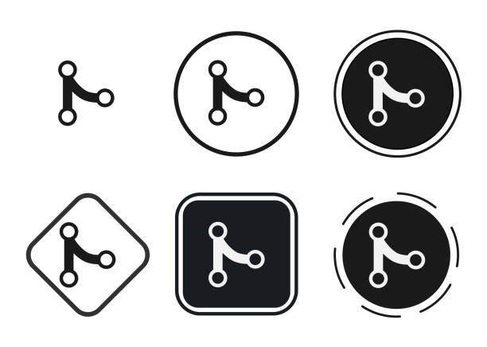

# Understanding Git Branches

## What is a Git Branch?
A **branch** in Git is essentially a pointer to one of the commits in your repository's history. By default, every Git repository starts with a branch called `main` (or `master` in older versions). Branches allow you to isolate your work, which is useful for developing features, fixing bugs, or experimenting without affecting the main project.

## Key Concepts of Git Branches

### 1. **Why Use Branches?**
Branches in Git provide a way to:

- **Isolate work**: Work on a feature or bug fix without disturbing the main or stable codebase.
- **Parallel Development**: Multiple developers can work on different features at the same time.
- **Experimentation**: Safely try out new ideas without affecting the main project.

### 2. **How Branching Works**
- When you create a new branch, it is based on the current state of the branch you're on (often `main`).
- The new branch starts off with the same history as the branch it was branched from.
- You can work on the new branch independently. Any commits made will only affect that branch.
- To merge your changes into the main branch, you'll perform a **merge**.

## Basic Git Branch Commands

### 1. **Create a New Branch**
git branch <branch-name>
# Branching Workflows and Best Practices

## 1. Feature Branch Workflow
- Each new feature gets its own branch.
- After the feature is developed, it is merged back into the `main` or `development` branch.

## 2. GitFlow Workflow
GitFlow is a branching model that organizes branches into:

- **`main`**: Contains production-ready code.
- **`develop`**: Serves as the integration branch for features.
- **Feature branches**: Used for developing new features.
- **Release branches**: Used for preparing a new production release.
- **Hotfix branches**: Used for quick fixes in production.

## 3. GitHub Flow
A simplified workflow primarily used in GitHub-based projects:

- Work directly from the `main` branch with feature branches.
- Merge pull requests once a feature is complete.

## Branching Best Practices

- **Keep branches focused**: Each branch should have a clear purpose (e.g., one for a bug fix, one for a feature).
- **Create short-lived branches**: Avoid long-lived branches that diverge too much from `main`, as they can be harder to merge later.
- **Use descriptive branch names**: Make the purpose of the branch clear with names like `feature/login-page`, `bugfix/issue-123`, or `hotfix/crash-fix`.
- **Regularly merge changes**: Ensure that you merge changes from `main` into your feature branches to avoid major merge conflicts.

